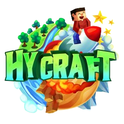

# 🌐 HyCraft Network | Sitio Web Oficial

¡Bienvenidos a la web oficial de **HyCraft Network**! 🎉



---

## 🏠 Inicio

HyCraft Network es un servidor de Minecraft en español, fundado en 2021. Desde entonces, hemos crecido de manera constante, atrayendo a una comunidad diversa y entusiasta. 🚀

### 🎮 Juegos Disponibles:
- **SkyWars**
- **Bedwars**
- **ArenaPvP**
- **Practice**
- **KBFFA**
- **SkyBlock**
- **Survival** (compatible con versiones 1.8 - 1.17)
- **TheBridge**
- **TnT Games**
- **SquidGame**

¡Únete a la diversión y forma parte de nuestra creciente familia! 🤗

---

## 📋 Reglas

Asegúrate de leer y seguir nuestras [reglas](reglas.html) para mantener un ambiente de juego justo y divertido para todos. ✅

---

## © Copyright

© 2024 HyCraft - Todos los derechos reservados. | By SuperYoscar

---

## 🚀 Cómo Ejecutar el Proyecto Localmente

1. Clona el repositorio:
    ```sh
    git clone https://github.com/yoscarmjp/H-Proyect.git
    ```

2. Navega al directorio del proyecto:
    ```sh
    cd hycraft-network
    ```

3. Abre `index.html` en tu navegador favorito.

¡Gracias por visitar nuestro sitio! 🥳
